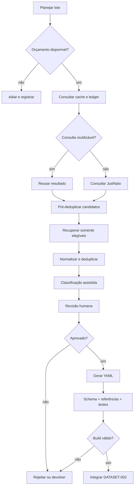

# Predator Intelligence — Expansão de Acervo e Ingestão Jurisprudencial

**Documento:** Especificação arquitetural e operacional  
**Projeto:** Predator News — Inteligência Jurídica  
**Versão:** 1.0  
**Data:** 08/08/2026  
**Status:** Formalizado para orientar o ciclo DATASET-002  
**Ciclo anterior:** EP01–EP06.1 concluído — pronto com pendências não bloqueantes

---

## 1. Finalidade

Este documento formaliza a arquitetura do segundo ciclo da Predator Intelligence, responsável por ampliar o acervo jurisprudencial a partir de consultas ao JusRatio sem romper os princípios estabelecidos no MVP.

O fluxo-alvo é:

```text
JusRatio
  → lote de candidatos
  → deduplicação contra o Predator
  → classificação assistida
  → revisão humana
  → YAML canônico
  → validação e build
```

O ciclo abrange:

- DATASET-002;
- pipeline de ingestão via JusRatio;
- orçamento e controle de consultas;
- prevenção de consultas redundantes;
- deduplicação prévia e pós-recuperação;
- classificação assistida;
- revisão humana obrigatória;
- geração segura de YAML;
- integração futura, mas não imediata, com o Predator News Publisher.

O objetivo não é automatizar a interpretação jurídica. O objetivo é reduzir trabalho repetitivo de localização, triagem, normalização e preparação, mantendo a decisão jurídica e editorial sob responsabilidade humana.

---

## 2. Base consolidada que este ciclo deve preservar

O DATASET-001 encerrou o primeiro ciclo com:

- 10 decisões reais;
- TJPI: 7 decisões;
- TJCE: 2 decisões;
- TJMA: 1 decisão;
- 1 tese ativa;
- 6 fundamentos;
- taxonomia e aliases;
- JSON Schemas;
- validação estrutural, referencial e jurídica;
- geração estática e build validados;
- 36 testes aprovados ao final do EP06.1.

Essa distribuição é a fotografia do DATASET-001, não uma allowlist permanente. O manifesto de cada lote pode selecionar outros tribunais, produtos e teses desde que os valores estejam cadastrados, validados e revisados antes da promoção.

Permanecem vinculantes:

1. a separação entre Predator Editorial e Predator Intelligence;
2. a persistência canônica em arquivos versionados no Git;
3. a ausência de banco de dados como requisito deste ciclo;
4. a rastreabilidade da fonte jurídica;
5. a distinção entre fonte jurídica e origem de recuperação;
6. a classificação granular de tese, provas e resultados;
7. a proibição de inferir resultado global simplificado;
8. o uso de relações derivadas, evitando totais duplicados;
9. a revisão jurídica antes da publicação;
10. a regra de que síntese editorial não equivale a citação literal.

Quando houver `frase_peca`, permanece obrigatória a identificação:

> Síntese editorial Predator — não corresponde a citação literal de decisão judicial.

O preenchimento de `frase_peca` permanece opcional e sujeito a curadoria humana.

---

## 3. Princípios arquiteturais

### 3.1. Pipeline orientado a estados

Cada candidato deve possuir estado explícito e histórico mínimo de transições. Nenhuma etapa deve depender apenas da posição de um arquivo em uma pasta.

Estados previstos:

```text
discovered
  → prechecked
  → retrieved
  → normalized
  → duplicate | needs_review
  → classified
  → human_approved | human_rejected | returned
  → yaml_generated
  → validated
  → published
```

Estados terminais operacionais:

- `duplicate`: já representado pelo acervo;
- `human_rejected`: não integra o acervo, com motivo registrado;
- `published`: integrado ao acervo canônico;
- `blocked`: não pode avançar por ausência de fonte, inconsistência ou erro técnico.

### 3.2. Idempotência

Reexecutar um lote com a mesma configuração não deve:

- consumir nova cota sem necessidade;
- criar candidatos duplicados;
- sobrescrever revisão humana;
- gerar dois YAMLs para a mesma decisão;
- alterar arquivos canônicos já aprovados.

### 3.3. Separação entre área de trabalho e acervo canônico

Os candidatos e artefatos intermediários não pertencem a `data/jurisprudencia/`.

Estrutura conceitual:

```text
data/
├── jurisprudencia/           # somente registros aprovados e canônicos
├── teses/
├── fundamentos/
└── taxonomy/

ingestion/
├── config/
├── state/
├── batches/
├── cache/
└── reports/
```

A localização física final deverá respeitar a arquitetura real do repositório. O princípio obrigatório é: **candidato não revisado nunca entra no diretório canônico**.

### 3.4. Automação conservadora

A automação pode sugerir. Não pode, sem revisão humana:

- criar nova tese;
- criar novo fundamento;
- fundir conceitos jurídicos;
- alterar enums ou taxonomia;
- afirmar tendência ou entendimento consolidado;
- preencher lacuna jurídica por inferência;
- produzir `frase_peca` como se fosse trecho do julgado;
- publicar decisão no acervo.

---

## 4. Arquitetura do fluxo



### 4.1. Componentes

| Componente | Responsabilidade | Pode alterar acervo canônico? |
| --- | --- | --- |
| Planejador de lote | Define escopo, consultas e limites | Não |
| Budget guard | Autoriza ou bloqueia consumo de cota | Não |
| Query cache | Reutiliza consultas ainda válidas | Não |
| Query ledger | Registra consultas e consumo | Não |
| Coletor JusRatio | Recupera resultados e detalhes | Não |
| Normalizador | Padroniza campos e identificadores | Não |
| Deduplicador | Compara candidato, lote e acervo | Não |
| Classificador assistido | Sugere taxonomia e resultados | Não |
| Estação de revisão | Registra decisão humana | Não diretamente |
| Gerador YAML | Produz arquivo proposto | Somente após aprovação |
| Validador/build | Aplica gates já existentes | Não |
| Integrador | Move YAML validado ao acervo | Sim, sob gate |

---

## 5. DATASET-002

### 5.1. Natureza

O DATASET-002 será o primeiro lote de expansão produzido pelo novo pipeline. Ele não é um novo épico numerado como EP07. É um ciclo de dados e operação apoiado na infraestrutura já validada.

### 5.2. Objetivos

1. provar que o pipeline economiza consultas e trabalho manual;
2. ampliar o acervo sem reduzir a qualidade jurídica;
3. testar deduplicação contra os 10 registros existentes;
4. medir precisão da classificação assistida;
5. validar a revisão humana antes de qualquer integração com o Publisher;
6. produzir métricas reais para dimensionar lotes futuros.

### 5.3. Escopo jurídico inicial

O primeiro lote deve permanecer próximo do domínio já validado:

- cartão de crédito consignado;
- RMC e RCC;
- vício de consentimento;
- dever de informação;
- contratação digital;
- autenticidade e consentimento;
- uso ou ausência de uso do cartão;
- saque único;
- repetição de indébito;
- dano moral, quando enfrentado.

Novas teses ou fundamentos identificados devem ser registrados como `taxonomy_proposal`, sem criação automática.

### 5.4. Tamanho do lote

O tamanho não deve ser fixado antes de conhecer a cota contratada e o custo real de cada operação no JusRatio.

O lote será definido por três limites simultâneos:

```text
máximo de candidatos descobertos
máximo de consultas autorizadas
máximo de decisões aprovadas para revisão
```

O processamento encerra ao atingir o primeiro limite.

### 5.5. Critérios de aceite

O DATASET-002 estará pronto quando:

- todas as consultas estiverem registradas no ledger;
- não houver repetição evitável de consultas;
- todos os candidatos tiverem fingerprint;
- a deduplicação tiver sido executada antes da recuperação onerosa, quando possível;
- toda decisão aceita tiver fonte jurídica rastreável;
- toda classificação publicada tiver revisão humana registrada;
- nenhum novo conceito jurídico tiver sido criado silenciosamente;
- os YAMLs passarem em schema, validação referencial e testes jurídicos;
- o build e a regressão do site forem aprovados;
- houver relatório de cota, deduplicação, rejeições e produtividade.

---

## 6. Planejamento e identidade do lote

Cada lote deverá possuir manifesto imutável após o início:

```yaml
batch_id: dataset-002-2026-08-08-a
dataset: DATASET-002
created_at: 2026-08-08T00:00:00Z
status: planned

scope:
  # Exemplo do lote piloto; não é uma lista estrutural fechada.
  tribunais: [TJCE, TJMA, TJPI]
  produtos: [rmc, rcc]
  tese_seed: vicio_consentimento_cartao_consignado
  periodo_publicacao:
    inicio: null
    fim: null

limits:
  candidates: null
  query_units: null
  review_queue: null

query_plan_version: 1
taxonomy_version: 1
schema_version: 1
```

O `batch_id` deve ser único e estável. Alteração de escopo após o início gera novo lote ou nova versão expressamente registrada.

---

## 7. Orçamento de consultas e controle de cota

### 7.1. Configuração

O orçamento deve ficar fora do código de negócio e admitir configuração mensal:

```yaml
period: 2026-08
monthly_limit: null
hard_stop: null
reserve:
  manual_research: null
  retries: null
  publisher_future: null
alerts:
  warning_percent: 70
  critical_percent: 90
```

Os valores absolutos permanecem pendentes até confirmação do plano/cota do JusRatio.

### 7.2. Regra de disponibilidade

```text
disponível = limite_mensal
             − consumo_confirmado
             − consumo_reservado
             − reserva_operacional
```

Uma execução só pode começar se o custo máximo estimado do passo estiver dentro do disponível.

### 7.3. Budget guard

Antes de cada operação onerosa, o guard deve:

1. identificar o tipo da operação;
2. verificar cache elegível;
3. estimar custo máximo;
4. reservar unidades de forma atômica;
5. autorizar ou bloquear;
6. reconciliar estimativa e consumo real;
7. registrar falhas e eventuais estornos.

Nenhum módulo pode consultar o JusRatio contornando o budget guard.

### 7.4. Ledger de consumo

Registro mínimo:

```yaml
entry_id: qr-2026-08-000001
timestamp: 2026-08-08T00:00:00Z
batch_id: dataset-002-2026-08-08-a
operation: search
query_fingerprint: sha256:...
status: success
estimated_units: 1
consumed_units: 1
cache_hit: false
retry_of: null
```

O ledger deve ser append-only. Correções são feitas por lançamento compensatório, não por remoção silenciosa do histórico.

### 7.5. Reservas

Devem existir reservas independentes para:

- pesquisa manual urgente;
- repetição técnica controlada;
- eventual integração futura com Publisher.

O pipeline ordinário não pode consumir essas reservas sem autorização explícita.

### 7.6. Falha segura

Na ausência de informação confiável sobre cota ou consumo, o comportamento padrão é bloquear novas consultas e permitir somente:

- leitura de cache;
- deduplicação local;
- classificação de candidatos já recuperados;
- revisão humana;
- geração e validação de YAML já autorizado.

---

## 8. Regras para evitar consultas redundantes

### 8.1. Fingerprint canônico da consulta

Antes da execução, a consulta deve ser normalizada:

- remover espaços excedentes;
- normalizar caixa e acentuação apenas para comparação;
- ordenar filtros sem significado posicional;
- normalizar datas e tribunais;
- resolver aliases pela taxonomia;
- remover parâmetros com valor padrão;
- incluir versão do plano de busca.

O resultado normalizado gera `query_fingerprint` por hash.

### 8.2. Consulta semanticamente equivalente

Consultas com termos diferentes, mas resolvidas para os mesmos aliases e filtros, devem compartilhar fingerprint quando forem operacionalmente equivalentes.

Exemplo:

```text
RMC + vício de vontade + TJCE
reserva de margem consignável + vício de consentimento + TJCE
```

Somente serão equivalentes se o plano de busca declarar os termos como aliases da mesma estratégia. A equivalência não deve ser inferida livremente pelo modelo.

### 8.3. Política de cache

Cada resultado deve registrar:

```yaml
query_fingerprint: sha256:...
executed_at: 2026-08-08T00:00:00Z
expires_at: 2026-08-15T00:00:00Z
result_count: 25
provider_cursor: null
raw_snapshot: path-or-reference
```

Regras:

- cache válido deve ser reutilizado;
- cache expirado não é apagado, apenas deixa de autorizar reutilização automática;
- consultas históricas fechadas podem ter validade longa;
- consultas por período recente devem ter validade curta;
- mudança material no plano de consulta invalida equivalência;
- reexecução forçada exige motivo e registro no ledger.

### 8.4. Janela incremental

Após a primeira carga, buscas recorrentes devem priorizar janelas incrementais:

```text
última_data_coberta − margem_de_sobreposição
até
data_atual
```

A margem de sobreposição protege contra indexação tardia. Duplicidades geradas pela sobreposição devem ser eliminadas localmente.

### 8.5. Busca antes de detalhe

O pipeline deve separar:

1. consulta de listagem/metadados;
2. pré-deduplicação local;
3. recuperação de detalhes apenas para candidatos elegíveis.

Não se deve recuperar inteiro teor ou detalhe oneroso de item já identificado como duplicado por chave forte.

### 8.6. Paginação controlada

Cada página deve registrar cursor, intervalo e fingerprint. Uma página já concluída não deve ser refeita, salvo:

- resultado incompleto;
- cursor inválido;
- reexecução autorizada;
- mudança material da consulta.

---

## 9. Modelo do candidato

O candidato é uma entidade temporária e auditável:

```yaml
candidate_id: cand-dataset-002-0001
batch_id: dataset-002-2026-08-08-a
status: retrieved

discovery:
  provider: jusratio
  query_fingerprint: sha256:...
  discovered_at: 2026-08-08T00:00:00Z
  provider_record_id: null
  provider_url: null

identity:
  tribunal: TJCE
  processo_raw: null
  processo_cnj: null
  decision_date: null
  publication_date: null
  orgao_julgador: null
  relator: null

fingerprints:
  strong: null
  metadata: null
  content: null

source:
  natureza: jurisprudencia_oficial
  recuperado_via: jusratio
  url_original: null
  url_inteiro_teor: null
  verified: false

deduplication:
  status: pending
  matched_decision_id: null
  confidence: null
  reasons: []

classification:
  status: pending
  suggestions: {}
  confidence: {}
  taxonomy_proposals: []

review:
  status: pending
  reviewer: null
  reviewed_at: null
  decision: null
  notes: null
```

Dados brutos recuperados devem permanecer separados da interpretação normalizada para permitir auditoria.

---

## 10. Deduplicação

### 10.1. Momentos obrigatórios

A deduplicação ocorre em quatro pontos:

1. antes de consulta, pelo fingerprint da consulta;
2. dentro do lote, antes de recuperar detalhes;
3. contra o acervo canônico, antes da classificação;
4. antes da integração do YAML, como gate final.

### 10.2. Chaves fortes

Ordem preferencial:

1. tribunal + número CNJ normalizado;
2. identificador oficial estável da decisão;
3. tribunal + número processual não CNJ validado + órgão/data;
4. hash confiável do inteiro teor, quando disponível e juridicamente comparável.

Correspondência por chave forte resulta em `duplicate` automático, sem excluir a trilha do candidato.

### 10.3. Chaves auxiliares

Na ausência de chave forte, comparar:

- tribunal;
- número de processo parcial ou normalizado;
- órgão julgador;
- relator;
- data de julgamento/publicação;
- classe processual;
- partes, quando disponíveis e permitido;
- hash de ementa ou inteiro teor normalizado.

### 10.4. Faixas de decisão

| Resultado | Tratamento |
| --- | --- |
| Duplicidade exata | Bloqueio automático |
| Duplicidade provável | Revisão humana obrigatória |
| Possível relação, mas decisões distintas | Manter ambas e registrar relação se suportada |
| Sem correspondência | Prosseguir |

Um score pode ordenar a fila de revisão, mas não substitui a regra por chaves nem autoriza publicação.

### 10.5. Atualização não é duplicação simples

Quando o mesmo processo contiver decisões distintas, o sistema deve distinguir a unidade jurisprudencial catalogada. Mesmo processo não implica necessariamente mesmo julgamento.

O identificador canônico poderá precisar de sufixo documentado quando houver mais de uma decisão relevante no mesmo processo. Essa decisão exige revisão humana e não deve ser inventada pelo pipeline.

---

## 11. Classificação assistida

### 11.1. Função

A classificação assistida prepara uma proposta estruturada a partir do conteúdo recuperado e da taxonomia vigente.

Ela pode sugerir:

- produto;
- tema;
- perfil do consumidor;
- meio de contratação;
- fatos relevantes;
- provas presentes;
- efeitos atribuídos às provas;
- teses enfrentadas;
- status de cada tese;
- fundamentos existentes;
- resultado granular;
- autoridade da decisão;
- campos ausentes ou contraditórios.

### 11.2. Evidência por campo

Cada sugestão relevante deve conter:

```yaml
value: acolhida
confidence: 0.91
evidence:
  - source: inteiro_teor
    locator: paragraph-or-section-reference
    excerpt: trecho curto para conferência
```

O trecho serve para revisão interna e deve respeitar limites de reprodução. Ele não se torna automaticamente conteúdo público.

### 11.3. Restrições

O classificador não pode:

- converter ausência de informação em resultado negativo;
- presumir consentimento a partir de autenticação;
- presumir dano moral a partir do acolhimento da tese;
- presumir repetição em dobro a partir da declaração de invalidade;
- preencher órgão, relator ou data sem evidência;
- transformar ementa incompleta em análise do inteiro teor;
- usar o resumo do JusRatio como substituto silencioso da fonte jurídica;
- criar texto de `frase_peca` sem revisão humana.

### 11.4. Confiança

Confiança é indicador operacional, não grau de verdade jurídica.

Sugestões abaixo do limiar configurado devem ser marcadas `uncertain`. Mesmo sugestões de alta confiança permanecem sujeitas a revisão humana.

### 11.5. Propostas de taxonomia

Termo não mapeado deve gerar:

```yaml
taxonomy_proposal:
  raw_term: erro substancial
  suggested_alias_of: vicio_consentimento_cartao_consignado
  reason: termo encontrado no julgado
  status: pending_human_review
```

O pipeline não modifica `taxonomy.yaml`, `aliases.yaml`, teses ou fundamentos automaticamente.

---

## 12. Revisão humana

### 12.1. Gate obrigatório

Nenhuma decisão ingressa em `data/jurisprudencia/` sem revisão humana registrada.

### 12.2. Checklist mínimo

O revisor deve confirmar:

- identidade da decisão;
- ausência de duplicidade;
- tribunal, processo, órgão, relator e datas;
- natureza e rastreabilidade da fonte;
- correspondência entre fatos e documento;
- produtos e temas;
- provas e efeitos;
- tese e respectivo status;
- fundamentos usados;
- resultados de contrato, conversão, repetição e dano moral;
- autoridade jurisprudencial;
- ausência de conclusão não suportada;
- necessidade de nova tese, fundamento ou alias;
- eventual `frase_peca` e seu rótulo obrigatório.

### 12.3. Decisões possíveis

```text
approve
approve_with_edits
return_for_reclassification
reject_irrelevant
reject_insufficient_source
reject_duplicate
block_taxonomy_decision
```

### 12.4. Segregação recomendada

Sempre que operacionalmente viável:

- a automação prepara;
- o revisor jurídico aprova o conteúdo;
- a validação técnica confirma integridade;
- a integração ocorre somente depois dos dois gates.

---

## 13. Geração do YAML canônico

### 13.1. Momento

O YAML só será gerado após `human_approved` ou `approve_with_edits`.

### 13.2. Regras

- usar o schema vigente;
- preservar IDs e slugs estáveis;
- ordenar campos conforme convenção do projeto;
- não incluir dados operacionais do candidato no YAML público;
- registrar origem de recuperação como JusRatio quando aplicável;
- registrar a fonte jurídica separadamente;
- usar `null` apenas quando admitido pelo schema;
- não emitir placeholders textuais;
- não gerar `frase_peca` ausente;
- não sobrescrever arquivo canônico existente.

### 13.3. Proveniência

O vínculo entre YAML canônico e candidato deve permanecer em manifesto de ingestão, sem poluir a experiência pública:

```yaml
decision_id: tjce-...
candidate_id: cand-dataset-002-0001
batch_id: dataset-002-2026-08-08-a
review_record: review-0001
generated_at: 2026-08-08T00:00:00Z
```

---

## 14. Gates de validação e build

O pipeline só poderá integrar o lote se passar, nesta ordem:

1. validação YAML;
2. JSON Schema;
3. taxonomia e enums;
4. referências a teses e fundamentos;
5. unicidade de IDs e CNJ;
6. deduplicação final contra a branch atual;
7. testes de consistência jurídica;
8. testes de agregação;
9. build estático;
10. regressão das páginas existentes.

Falha em qualquer gate impede integração do item afetado. O lote pode admitir integração parcial apenas se:

- os itens forem independentes;
- os aprovados continuarem referencialmente válidos;
- a exclusão dos bloqueados estiver registrada;
- o build integral permanecer válido.

---

## 15. Relatórios e métricas

Cada lote deve produzir relatório com:

### 15.1. Funil

- resultados descobertos;
- candidatos únicos;
- duplicados antes do detalhe;
- detalhes recuperados;
- duplicados após normalização;
- enviados à revisão;
- aprovados;
- rejeitados por motivo;
- YAMLs gerados;
- registros integrados.

### 15.2. Cota

- limite mensal configurado;
- saldo inicial e final;
- unidades estimadas e consumidas;
- cache hits;
- consultas evitadas;
- retries;
- consumo por decisão publicada;
- reservas preservadas.

### 15.3. Qualidade

- campos corrigidos por revisão humana;
- sugestões aceitas e rejeitadas por família;
- falsos positivos de deduplicação;
- duplicidades não detectadas automaticamente;
- propostas de taxonomia;
- falhas de schema, referência e build.

### 15.4. Indicadores operacionais

```text
taxa_de_deduplicação = duplicados / candidatos_descobertos
taxa_de_aprovação = aprovados / enviados_à_revisão
economia_de_consulta = consultas_evitadas / consultas_potenciais
custo_por_registro = unidades_consumidas / registros_integrados
precisão_assistida = campos_aceitos_sem_edição / campos_sugeridos
```

Esses indicadores medem operação. Não representam score jurídico nem tendência jurisprudencial.

---

## 16. Integração futura com o Publisher

### 16.1. Limite deste ciclo

O Publisher não deve passar a publicar automaticamente jurisprudência durante o DATASET-002.

O fluxo inicial permanece desacoplado:

```text
Pipeline de ingestão → acervo aprovado
Publisher → edição diária
```

### 16.2. Integração futura permitida

Após validação operacional, o Publisher poderá:

- consultar se uma notícia referencia decisão já catalogada;
- sugerir vínculo por `decision-id`;
- encaminhar decisão nova para a fila de candidatos;
- reutilizar candidato ou consulta já existente;
- respeitar o mesmo budget guard e ledger.

O Publisher não poderá:

- contornar deduplicação;
- consumir cota reservada sem autorização;
- gerar YAML canônico sem revisão;
- criar tese ou fundamento;
- converter notícia em decisão catalogada automaticamente;
- bloquear a publicação editorial por indisponibilidade do JusRatio.

### 16.3. Critérios para autorizar integração

A integração só deve avançar depois de pelo menos um lote DATASET-002 concluído e relatório que demonstre:

- idempotência;
- controle confiável de cota;
- deduplicação aceitável;
- revisão humana operável;
- ausência de regressão;
- custo por registro conhecido;
- procedimento de falha segura validado.

---

## 17. Segurança, privacidade e rastreabilidade

- Não persistir credenciais em arquivos versionados.
- Não registrar tokens, cookies ou cabeçalhos sensíveis no ledger.
- Minimizar dados pessoais não necessários à pesquisa jurisprudencial.
- Preservar termos de uso e limites técnicos da fonte consultada.
- Registrar versão do schema, taxonomia e classificador usados.
- Manter snapshots brutos apenas pelo prazo necessário e permitido.
- Garantir que logs técnicos não sejam incorporados às páginas públicas.
- Toda alteração humana relevante deve possuir autor, data e motivo.

---

## 18. Tratamento de falhas

| Falha | Comportamento |
| --- | --- |
| Cota desconhecida ou esgotada | Bloquear chamadas externas e continuar trabalho local |
| JusRatio indisponível | Preservar estado e retomar sem repetir etapas concluídas |
| Resposta incompleta | Marcar candidato como `blocked` ou `insufficient_source` |
| CNJ inválido | Não gerar ID canônico; encaminhar para revisão |
| Duplicidade provável | Bloquear avanço automático |
| Nova taxonomia necessária | Registrar proposta e aguardar decisão humana |
| Schema inválido | Impedir integração |
| Build quebrado | Reverter apenas a proposta do lote; preservar artefatos de auditoria |
| Conflito com alteração recente do acervo | Reexecutar deduplicação e validação contra a versão atual |

---

## 19. Backlog de implementação

### IN01 — Infraestrutura operacional de ingestão — P0

- criar estrutura de configuração, lotes, estado, cache e relatórios;
- definir schemas para manifesto, candidato, ledger e revisão;
- garantir que artefatos intermediários não entrem no build público.

### IN02 — Orçamento, ledger e cache — P0

- implementar budget guard;
- fingerprint canônico de consulta;
- ledger append-only;
- reservas e hard stop;
- política de cache e reexecução autorizada.

### IN03 — Coleta JusRatio em duas fases — P0

- busca/listagem;
- paginação retomável;
- pré-deduplicação;
- recuperação seletiva de detalhes;
- snapshots e normalização de resposta.

### IN04 — Deduplicação multicamada — P0

- lote contra lote;
- lote contra acervo;
- chaves fortes e auxiliares;
- fila de duplicidade provável;
- gate final pré-integração.

### IN05 — Classificação assistida — P1

- sugestões restritas à taxonomia vigente;
- evidência por campo;
- confiança operacional;
- detecção de contradições e lacunas;
- propostas de taxonomia sem mutação automática.

### IN06 — Revisão humana — P0

- checklist;
- decisões e motivos padronizados;
- edição controlada;
- trilha de auditoria;
- bloqueio de geração antes da aprovação.

### IN07 — Gerador YAML e integração — P0

- transformação determinística;
- proveniência;
- schemas, validações e testes existentes;
- integração parcial segura;
- relatório final do lote.

### IN08 — DATASET-002 — P0

- configurar primeiro lote;
- executar fluxo completo;
- revisar decisões;
- integrar apenas aprovadas;
- medir cota, deduplicação e precisão assistida.

### IN09 — Ponte futura com Publisher — P2

- somente após aceite do DATASET-002;
- sugestão de vínculos e encaminhamento à fila;
- orçamento compartilhado com reserva própria;
- nenhuma publicação jurisprudencial autônoma.

---

## 20. Ordem obrigatória

```text
Incremento A: IN01 + IN02
Incremento B: IN03 + IN04
Incremento C: IN05 + IN06
Incremento D: IN07
Incremento E: IN08 — DATASET-002
Incremento F: IN09 — somente após nova autorização
```

Não implementar a ponte com o Publisher antes de concluir e avaliar o DATASET-002.

---

## 21. Decisões pendentes antes da execução técnica

As seguintes decisões devem ser parametrizadas ou confirmadas na inspeção técnica, sem bloquear esta arquitetura:

1. plano do JusRatio e cota mensal efetiva;
2. custo por tipo de operação: busca, página, detalhe e inteiro teor;
3. limites absolutos e reservas do primeiro lote;
4. duração do cache por tipo de consulta;
5. tribunais e intervalo temporal do DATASET-002;
6. quantidade máxima de itens na fila de revisão;
7. identidade ou papel dos revisores;
8. prazo de retenção dos snapshots brutos;
9. capacidades técnicas e contratuais reais de integração com o JusRatio.

Na ausência desses valores, os componentes devem aceitar configuração nula, mas o budget guard deve bloquear consumo externo.

---

## 22. Definição de pronto do ciclo

O ciclo Predator Intelligence — Expansão de Acervo e Ingestão Jurisprudencial estará concluído quando:

1. o pipeline completo operar com estados persistidos e retomada segura;
2. a cota estiver protegida por guard, ledger, cache e reservas;
3. consultas redundantes forem evitadas por fingerprint e janela incremental;
4. detalhes só forem recuperados após pré-deduplicação;
5. candidatos forem deduplicados contra o acervo atual;
6. classificações trouxerem evidência e incerteza explícita;
7. toda publicação tiver aprovação humana rastreável;
8. YAMLs forem gerados deterministicamente após aprovação;
9. validações, 36 testes existentes e novos testes do pipeline passarem;
10. o build e as superfícies do Predator não sofrerem regressão;
11. o DATASET-002 for integrado com relatório completo;
12. a integração com Publisher permanecer desligada até autorização posterior.

---

## 23. Princípio permanente

> O JusRatio amplia a capacidade de descoberta; o Predator preserva a inteligência jurídica validada.

O pipeline deve maximizar reaproveitamento e rastreabilidade, minimizar consultas e trabalho repetitivo e manter a revisão humana no ponto em que a interpretação jurídica se torna material.

Cada nova decisão aprovada deve aumentar o valor de pesquisa do acervo sem diminuir sua confiabilidade.
